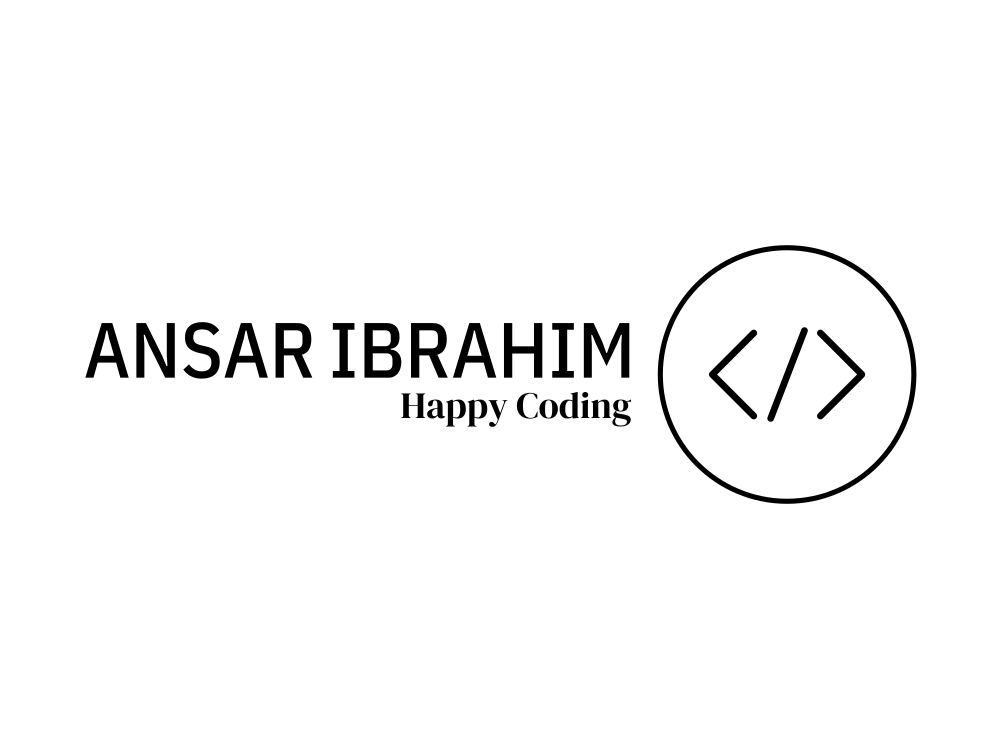

# currencymate

CurrencyMate simplifies currency conversions, allowing you to effortlessly convert between different currencies in real-time. With a user-friendly interface and up-to-date exchange rates, stay on top of your international transactions wherever you go.

<a name="readme-top"></a>

<div align="center">
  <!-- You are encouraged to replace this logo with your own! Otherwise you can also remove it. -->
  
  <br/>

  <h3><b>TechGear</b></h3>

</div>

<!-- TABLE OF CONTENTS -->

# 📗 Table of Contents

- [📖 About the Project](#about-project)
  - [🛠 Built With](#built-with)
    - [Tech Stack](#tech-stack)
    - [Key Features](#key-features)
  - [🚀 Live Demo](#live-demo)
- [💻 Getting Started](#getting-started)
  - [Setup](#setup)
  - [Prerequisites](#prerequisites)
  - [Install](#install)
  - [Usage](#usage)
  - [Run tests](#run-tests)
  - [Deployment](#triangular_flag_on_post-deployment)
- [👥 Authors](#authors)
- [🔭 Future Features](#future-features)
- [🤝 Contributing](#contributing)
- [⭐️ Show your support](#support)
- [🙏 Acknowledgements](#acknowledgements)
- [❓ FAQ (OPTIONAL)](#faq)
- [📝 License](#license)

<!-- PROJECT DESCRIPTION -->

# 📖 TechGear <a name="about-project"></a>

**TechGear** Explore innovative gadgets &amp; electronics. Shop now for the latest tech trends. Your destination for cutting-edge technology. 🚀.

## 🛠 Built With <a name="built-with"></a>

### Tech Stack <a name="tech-stack"></a>

<details>
  <summary>Client</summary>
  <ul>
    <li><a href="https://reactjs.org/">React.js</a></li>
    <li><a href="https://tailwindcss.com/">Tailwind CSS</a></li>
    <li><a href="https://developer.mozilla.org/en-US/docs/Web/HTML">HTML</a></li>
    <li><a href="https://developer.mozilla.org/en-US/docs/Web/CSS">CSS</a></li>
    <li><a href="https://developer.mozilla.org/en-US/docs/Web/JAVASCRIPT">JAVA-SCRIPT</a></li>
  </ul>
</details>

<!-- Features -->

### Key Features <a name="key-features"></a>

- **Innovative Gadgets & Electronics Exploration**
- **Latest Tech Trends Shopping**
- **Cutting-Edge Technology Destination**

<p align="right">(<a href="#readme-top">back to top</a>)</p>

<!-- LIVE DEMO -->

## 🚀 Live Demo <a name="live-demo"></a>

- [Live Demo Link](https://techgeargadget.netlify.app/)

<p align="right">(<a href="#readme-top">back to top</a>)</p>

<!-- GETTING STARTED -->

## 💻 Getting Started <a name="getting-started"></a>

If you want to get a local copy up and running, please follow these steps.

### Prerequisites

In order to run this project you need:

```sh
Modren Browser
```

### Setup

Clone this repository to your desired folder:

```sh
  git clone git@github.com:AnsarIbrahim/techgear.git
```

### Install

Install this project with:

```sh
  cd techgear
  npm install or npm i
```

### Usage

To run the project, execute the following command:

```sh
  npm start
```

### Run tests

To run tests, run the following command:

```sh
  npm test
```

### Deployment

You can deploy this project using:

```sh
 npm start
```

<p align="right">(<a href="#readme-top">back to top</a>)</p>

<!-- AUTHORS -->

## 👥 Authors <a name="authors"></a>

👤 **Ansar Ibrahim**

- GitHub: [Ansar Ibrahim](https://github.com/AnsarIbrahim)
- Twitter: [Ansar Ibrahim](https://twitter.com/ansaradheeb)
- LinkedIn: [Ansar Ibrahim](https://linkedin.com/in/ansar-ibrahim/)

<p align="right">(<a href="#readme-top">back to top</a>)</p>

<!-- FUTURE FEATURES -->

## 🔭 Future Features <a name="future-features"></a>

- [ ] **AI Product Recommendation**
- [ ] **Virtual Reality (VR) Product Showcase**
- [ ] **Product Comparison Tool**
- [ ] **User Reviews and Ratings**
- [ ] **Tech Blog**
- [ ] **Wishlist**
- [ ] **Advanced Search Filters**
- [ ] **Loyalty Program**

<p align="right">(<a href="#readme-top">back to top</a>)</p>

<!-- CONTRIBUTING -->

## 🤝 Contributing <a name="contributing"></a>

Contributions, issues, and feature requests are welcome!

Feel free to check the [issues page](../../issues/).

<p align="right">(<a href="#readme-top">back to top</a>)</p>

<!-- SUPPORT -->

## ⭐️ Show your support <a name="support"></a>

- If you like this project please give it a STAR⭐️

<p align="right">(<a href="#readme-top">back to top</a>)</p>

<!-- ACKNOWLEDGEMENTS -->

## 🙏 Acknowledgments <a name="acknowledgements"></a>

- I would like to thank the following
- Techno Hacks EduTech

<p align="right">(<a href="#readme-top">back to top</a>)</p>

<!-- FAQ (optional) -->

<!-- LICENSE -->

## 📝 License <a name="license"></a>

This project is [MIT](./LICENSE) licensed.

<p align="right">(<a href="#readme-top">back to top</a>)</p>
